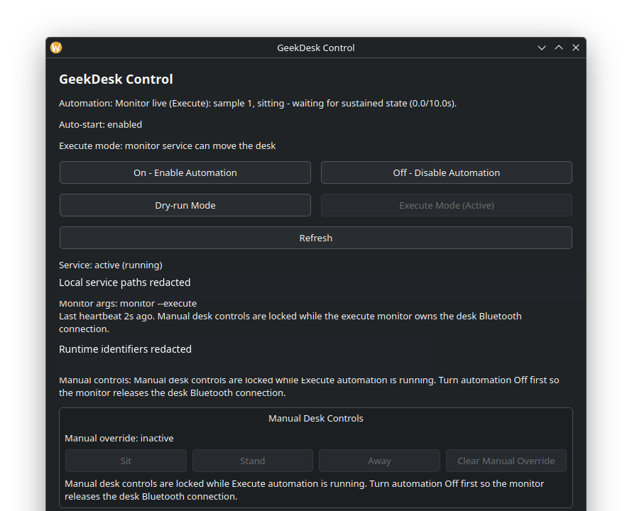

# IKEA Desk Automation

Local-first Bluetooth standing desk automation with optional Intel RealSense depth sensing.

This project controls compatible IKEA/LINAK standing desks directly over Bluetooth Low Energy on Linux. It does not require Home Assistant or cloud services. The current build supports explicit preset movement, audible movement alerts, in-motion backing alarms, RealSense depth diagnostics, conservative camera classification, an integrated GeekDesk Control settings/preview UI, and an experimental camera-driven monitor loop.

## Project Status

Current phase: functional hardware prototype with experimental RealSense-driven monitor automation and first-pass systemd user-service deployment.

Working:

- BLE discovery, pairing, read-only status, and preset movement through the `idasen` Python library.
- Configured desk presets for sitting, standing, and away/clearance height.
- Audible pre-movement warning and industrial backing alarm during desk travel.
- RealSense D455 availability detection through `pyrealsense2`.
- Depth-only RealSense sampling, ROI metrics, conservative posture classification, and read-only calibration guidance.
- GeekDesk Control desktop UI for service On/Off, dry-run/execute mode, manual sit/stand/away controls with a persistent override latch, settings editing, read-only desk height/speed, camera availability, and one-shot camera samples.
- Experimental `monitor` loop that can raise the desk to an away height when the user leaves, then return to the detected posture height when the user comes back.
- Systemd user-service deployment files for running the monitor as a local daemon, dry-run by default.
- KDE/Wayland-friendly desktop launcher for GeekDesk Control.
- Optional agent-operation notes in `SKILL.md`.

Not yet enabled:

- Visual desk-path safety validation beyond conservative obstruction metrics.
- Full production hardening around daemon operations and persistent event logs.

The camera classifier is intentionally conservative. If it reports `unsafe`, tune camera angle, ROI, and thresholds with read-only calibration commands before enabling any automation.

## Safety Posture

Motorized furniture can injure people, pets, or equipment. This project defaults to conservative behavior:

- Movement is limited to configured presets.
- Executed preset movement requires explicit `--execute`.
- Dry-runs are the default for preset commands.
- Audible alerts play before movement unless explicitly skipped.
- A backing alarm runs while movement is active.
- RealSense diagnostics are read-only unless `monitor --execute` is explicitly used.
- The monitor command defaults to dry-run decisions and requires explicit `--execute` for physical movement.
- Manual GeekDesk Control modes persist a manual override latch; camera automation does not resume until the override is cleared.
- Unsafe, unknown, low-confidence, or unavailable-camera states must not trigger automation.

## Requirements

Minimum:

- Linux with BlueZ.
- Python 3.11 or newer.
- A compatible IKEA/LINAK BLE standing desk.
- Bluetooth adapter supported by BlueZ.
- Speakers if audible alerts are desired.

Optional RealSense support:

- Intel RealSense camera, tested with D455.
- RealSense SDK runtime.
- `pyrealsense2` and `numpy`.
- A high-speed USB connection is recommended. USB 2.x can work for conservative profiles, but calibration and frame quality are limited.

## Install

Clone the repo and install in editable mode:

```bash
git clone https://github.com/GeekTheGreyBeard/ikeaDeskAutomation.git
cd ikeaDeskAutomation
python -m venv .venv
. .venv/bin/activate
python -m pip install -e ".[dev]"
```

Install RealSense support on hosts that will use depth sampling:

```bash
python -m pip install -e ".[dev,realsense]"
```

If `pyrealsense2` is already installed system-wide but not in the project venv, either install the optional extra in the venv or create a venv with system site packages. Do not assume RealSense diagnostics are working until `ikea-desk camera` succeeds in the same environment that will run the tool.

## Configure

Copy the example config:

```bash
mkdir -p ~/.config/ikea-desk
cp config.example.yaml ~/.config/ikea-desk/config.yaml
```

Edit `~/.config/ikea-desk/config.yaml` for your desk, presets, audio, automation timing, and camera calibration.

See [docs/CONFIGURATION.md](docs/CONFIGURATION.md) for every option.

## First Run

Start with read-only commands:

```bash
ikea-desk --config ~/.config/ikea-desk/config.yaml status
ikea-desk --config ~/.config/ikea-desk/config.yaml height
ikea-desk --config ~/.config/ikea-desk/config.yaml speed
ikea-desk --config ~/.config/ikea-desk/config.yaml camera
```

Check preset dry-runs before any physical movement:

```bash
ikea-desk --config ~/.config/ikea-desk/config.yaml preset sit
ikea-desk --config ~/.config/ikea-desk/config.yaml preset stand
ikea-desk --config ~/.config/ikea-desk/config.yaml preset away
```

Only run executed movement after confirming the area is clear:

```bash
ikea-desk --config ~/.config/ikea-desk/config.yaml preset sit --execute
ikea-desk --config ~/.config/ikea-desk/config.yaml preset stand --execute
```

## RealSense Calibration

Run camera diagnostics without moving the desk:

```bash
ikea-desk --config ~/.config/ikea-desk/config.yaml camera --sample --classify --calibrate
```

This starts a short depth-only sample, prints ROI metrics, classifies the current observation, and prints calibration guidance. Use it at each important posture and scene state:

- Chair sitting.
- Standing.
- Away from desk.
- Desk path intentionally clear.
- Desk path intentionally blocked with a safe test object.

Do not run `monitor --execute` until the classifier is stable across these states.

For a known floor target, use the calibration-target path instead of the posture ROI:

```bash
ikea-desk --config ~/.config/ikea-desk/config.yaml camera --target-distance-in 24
```

This is read-only. It samples multiple floor-oriented ROIs, compares measured depth against the expected camera-to-target distance, prints RealSense intrinsics, and reports deprojected camera-space target centroids. To save a durable capture log for transform fitting:

```bash
ikea-desk --config ~/.config/ikea-desk/config.yaml camera --target-distance-in 24 --target-log calibration/target-24.json
```

Use the JSON logs from 24, 48, 72, and 87 inch target passes as the centerline anchor set. A later left/right pass is still needed before lateral room-coordinate safety zones can be trusted.

## GeekDesk Control Local UI

Start the integrated desktop app:

```bash
geekdesk-control --config ~/.config/ikea-desk/config.yaml
```

Or use the packaged desktop launcher:

```bash
deploy/desktop/geekdesk-control.sh
```



GeekDesk Control is the primary local interface. It can:

- Turn the monitor service On or Off and show auto-start/current-service state.
- Switch between Dry-run Mode and Execute Mode while preserving the Off -> Execute Mode -> On guardrail.
- Activate manual Sit, Stand, or Away modes. In Dry-run Mode this only latches the override and reports the target height. In Execute Mode it requests the same validated preset movement used by `ikea-desk preset ... --execute`.
- Clear the manual override latch so camera automation can resume.
- Edit desk bounds, preset heights, automation timing, motion detection thresholds, audio settings, and camera calibration values.
- Save validated YAML back to the configured file and reload it.
- Read desk height/speed without moving the desk.
- Check RealSense availability and trigger a one-shot camera sample/preview with no desk movement.

Manual mode state is stored in `~/.config/ikea-desk/manual_override.json`. While it is active, `ikea-desk monitor` skips camera-driven moves and logs that manual override is active.

The Control app now reports actual monitor liveness from
`~/.config/ikea-desk/monitor_status.json`, not just systemd state. See
[docs/GEEKDESK_CONTROL.md](docs/GEEKDESK_CONTROL.md) for screenshots and the
Mermaid state-flow diagram that shows how systemd, service mode, and monitor
health combine into the visible Automation status.

## Browser Settings UI

The legacy browser UI remains available for compatibility:

```bash
ikea-desk --config ~/.config/ikea-desk/config.yaml ui
```

Open:

```text
http://127.0.0.1:8765/
```

The UI can:

- Edit desk bounds, preset heights, automation timing, motion detection thresholds, audio settings, and camera calibration values.
- Save validated YAML back to the configured file.
- Poll read-only desk height and speed.
- Show a live overlay for camera ROI, standing posture threshold, sampled top-y, and sampled centroid-y.
- Trigger a one-shot camera sample with no desk movement.

It exposes the same local settings/readout surface and also deliberately does not expose movement buttons.

## Experimental Monitor Automation

After calibration is stable, run the monitor in dry-run mode first:

```bash
ikea-desk --config ~/.config/ikea-desk/config.yaml monitor
```

The monitor samples the camera continuously, watches desk height/speed for manual movement, waits for sustained observations, and prints the movement it would make. While the GeekDesk Control manual override latch is active, it skips camera-driven movement entirely. While the desk is moving or briefly settling after movement, posture automation is paused so manual position changes do not trigger a competing automatic move. The validated beta cooldown is `45s`; after an executed sit/stand move, the camera must re-confirm the moved-to posture before the opposite posture can trigger another move. For the first away/return automation:

- `away`: move to `presets.away`.
- `sitting`: return to `presets.sit`.
- `standing`: return to `presets.stand`.

Physical movement requires explicit execution:

```bash
ikea-desk --config ~/.config/ikea-desk/config.yaml monitor --execute
```

For one-direction supervised tests, stop the monitor after the first accepted target action:

```bash
ikea-desk --config ~/.config/ikea-desk/config.yaml monitor --execute --stop-after-first-move
```

Keep manual desk controls within reach during first live tests.

## Daemon Deployment

The first daemon path runs the existing monitor loop as a systemd user service.
It starts in dry-run mode by default:

```bash
mkdir -p ~/.config/systemd/user ~/.config/ikea-desk
cp deploy/systemd/ikea-desk-monitor.service ~/.config/systemd/user/
cp deploy/systemd/service.env.example ~/.config/ikea-desk/service.env
systemctl --user daemon-reload
systemctl --user start ikea-desk-monitor.service
```

Use `journalctl --user -u ikea-desk-monitor.service -f` to watch decisions.
Only add `--execute` in `~/.config/ikea-desk/service.env` after dry-run daemon
behavior has been validated in the target physical environment.

See [docs/DAEMON.md](docs/DAEMON.md) for the full daemon workflow and
[docs/GEEKDESK_CONTROL.md](docs/GEEKDESK_CONTROL.md) for the integrated desktop
control app, screenshots, Mermaid state flow, and implementation notes.

## Agent Usage

This repo includes optional agent-operation notes in `SKILL.md` for local automation environments. See [docs/OPENCLAW.md](docs/OPENCLAW.md) for setup and safety workflow.

## Documentation

- [docs/CONFIGURATION.md](docs/CONFIGURATION.md): full config reference.
- [docs/CAMERA_GEOMETRY.md](docs/CAMERA_GEOMETRY.md): camera setup, desk geometry, and safety-zone calibration.
- [docs/DAEMON.md](docs/DAEMON.md): systemd user-service daemon deployment.
- [docs/GEEKDESK_CONTROL.md](docs/GEEKDESK_CONTROL.md): integrated desktop service, settings, and readout UI.
- [docs/OPENCLAW.md](docs/OPENCLAW.md): optional OpenClaw skill and agent usage.
- [docs/SAFETY.md](docs/SAFETY.md): physical testing and safety rules.
- [docs/PROJECT_STATUS.md](docs/PROJECT_STATUS.md): current implementation state and known limits.

## Development Checks

```bash
. .venv/bin/activate
pytest -q
ruff check .
```

## License

MIT

## Internal Documentation

Obsidian documentation: `OpenClaw/Projects/ikeaDeskAutomation/`
