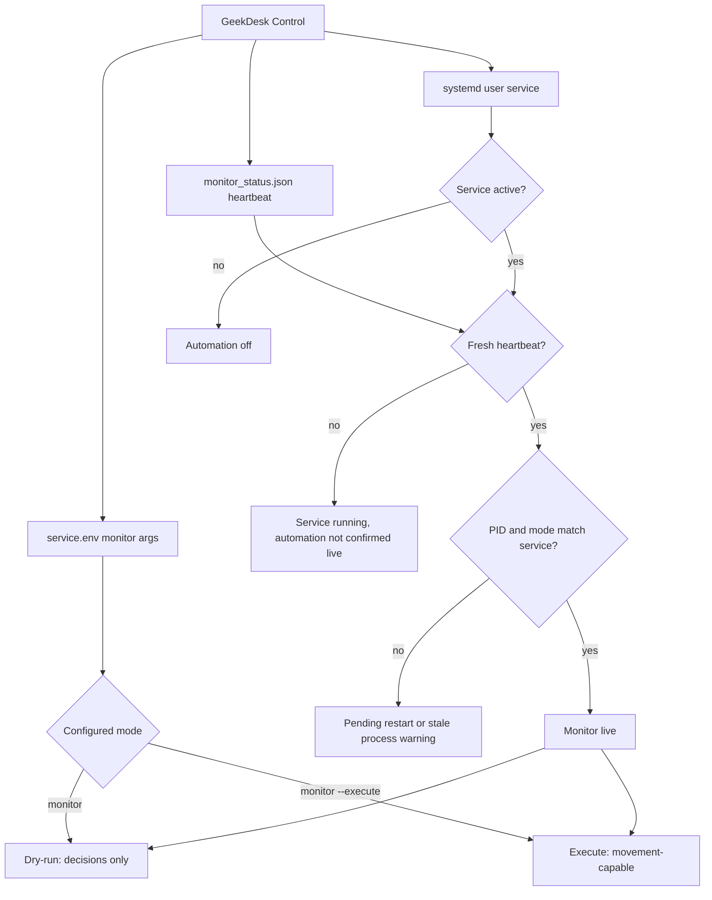
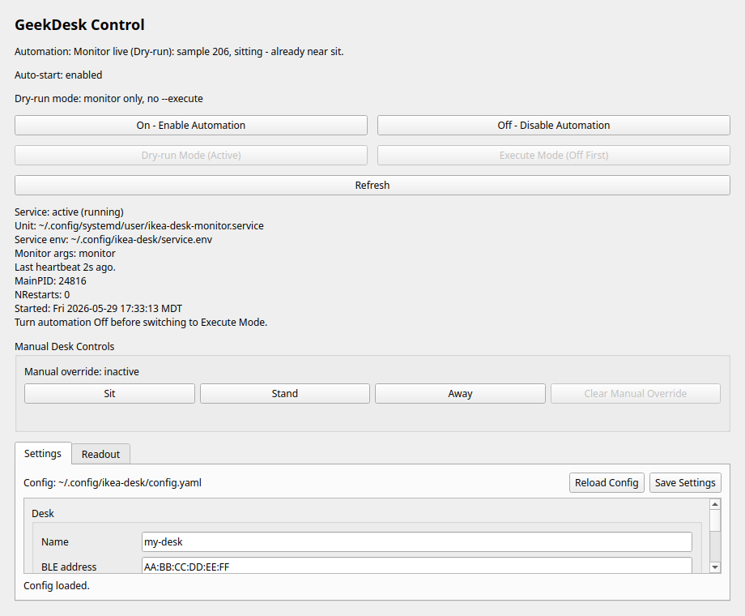
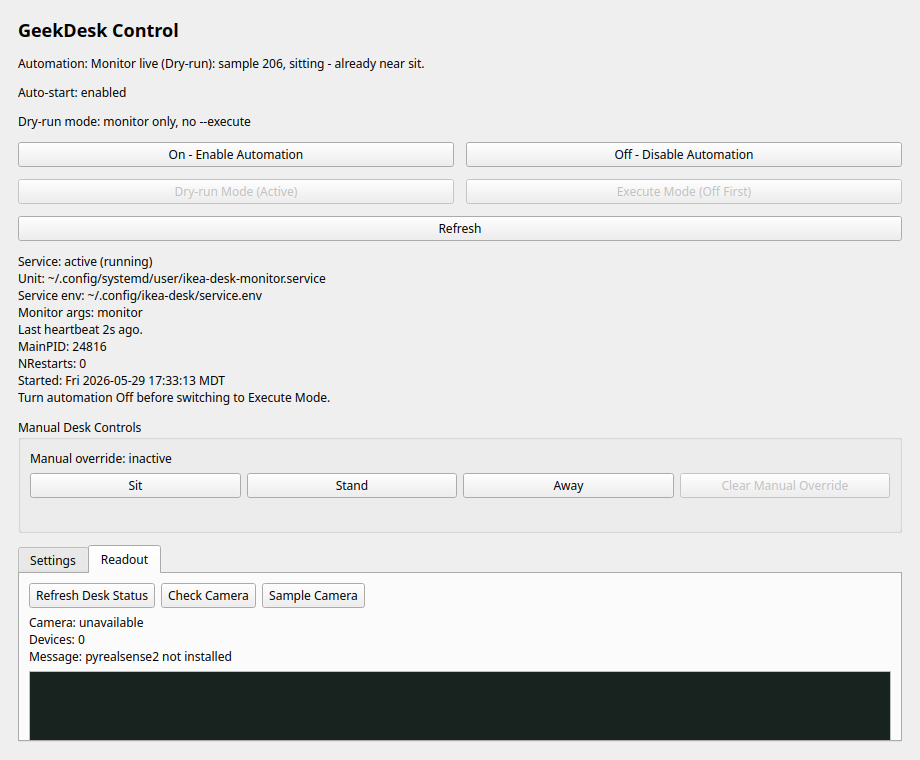

# GeekDesk Control

GeekDesk Control is a Qt desktop app for the local desk automation interface.
It keeps the `ikea-desk-monitor.service` On/Off and Dry-run/Execute controls
prominent, and now includes the local settings, read-only desk status, and
camera preview tools that were previously only available through the browser UI.

The **On** button enables automation with `systemctl --user enable --now`, so
the monitor starts now and is enabled for future user-session auto-start.

The **Off** button disables automation with `systemctl --user disable --now`, so
the monitor stops now and is no longer enabled for future auto-start.

The **Dry-run Mode** button writes `IKEA_DESK_MONITOR_ARGS="monitor"` in
`~/.config/ikea-desk/service.env`. If the monitor service is running, switching
back to dry-run restarts the service so the safer mode takes effect immediately.

The **Execute Mode** button writes `IKEA_DESK_MONITOR_ARGS="monitor --execute"`.
To avoid hidden movement, the app refuses to switch from dry-run to execute while
the monitor is already running. Use this sequence for live movement:

1. Click **Off - Disable Automation**.
2. Click **Execute Mode**.
3. Click **On - Enable Automation**.

The app shows both states separately:

- **Auto-start**: whether the systemd user service is enabled.
- **Automation**: whether the monitor heartbeat proves the loop is actually
  sampling, or whether it is missing, stale, still starting, or pending restart.
- **Service**: whether the systemd user service is active right now.
- **Dry-run/Execute mode**: whether the service env contains `--execute`.

The monitor writes its current runtime heartbeat to
`~/.config/ikea-desk/monitor_status.json`. GeekDesk Control reads that file so
it does not treat a green systemd service state as proof that automation is live.
The status view also surfaces the live PID, restart count, start timestamp, and
env-vs-running mode divergence when the service needs a restart before settings
take effect.

## Service State Flow

GeekDesk Control separates three signals that can otherwise look like the same
thing: systemd service state, configured dry-run/execute mode, and the monitor's
own sampling heartbeat.



The practical guardrail is:

1. **Off** stops and disables the monitor service.
2. **Dry-run Mode** writes `monitor`; if the service is running, it restarts so
   the safer mode takes effect immediately.
3. **Execute Mode** writes `monitor --execute` only while the service is Off.
4. **On** starts the service with the configured mode.

## Code Alignment

The user-visible behavior above is backed by these implementation surfaces:

- `SystemdUserService.snapshot()` reads `systemctl --user show` plus
  `~/.config/ikea-desk/service.env` and produces the service, auto-start, PID,
  restart count, start timestamp, and configured mode shown in the UI.
- `SystemdUserService.set_dry_run()` writes `monitor` and restarts an already
  running service so the safer mode takes effect immediately.
- `SystemdUserService.set_execute()` refuses to write `monitor --execute` while
  the service is running. This is the code-level enforcement for the documented
  **Off -> Execute Mode -> On** sequence.
- `MonitorStatusStore` reads `~/.config/ikea-desk/monitor_status.json`, which is
  written by `ikea-desk monitor` as it starts, connects, samples, accepts
  decisions, and stops.
- `assess_automation_health()` combines systemd state with the heartbeat. The UI
  only reports the monitor as live when a fresh heartbeat proves it is sampling
  and the heartbeat PID/runtime mode match the service.
- `LocalInterfaceState.activate_manual_mode()` writes the persistent manual
  override before any optional movement request, then uses the same validated
  `cmd_preset(..., execute=True)` path used by `ikea-desk preset NAME --execute`.
- `geekdesk-control --status` uses the same service snapshot and heartbeat
  assessment as the Qt app, so terminal status and GUI status should agree.

## Screenshots

These screenshots use fake desk state and a mocked dry-run heartbeat so they can
be checked into the repo without requiring hardware access.






## Manual Controls

GeekDesk Control exposes native **Sit**, **Stand**, and **Away** buttons. Pressing
one of these buttons always activates a persistent manual override latch before
any movement can be requested. The latch is stored at:

```text
~/.config/ikea-desk/manual_override.json
```

While the latch is active, `ikea-desk monitor` skips camera-driven movement and
logs that manual override is active. Camera automation resumes only after
clicking **Clear Manual Override**.

Manual controls follow the same dry-run/execute model as the service:

- In **Dry-run Mode**, pressing Sit/Stand/Away only records the manual override
  and reports the preset height that would be used. It does not move the desk.
- In **Execute Mode**, pressing Sit/Stand/Away records the override and requests
  the same validated preset movement path used by `ikea-desk preset NAME --execute`.

The manual buttons do not switch the app into Execute Mode. Use the existing
**Off -> Execute Mode -> On** sequence when physical service movement is wanted.

## Integrated Local Interface

The desktop app has native Qt tabs for:

- **Settings**: edit the same serialized config fields used by the local UI,
  including desk bounds/address, sit/stand/away presets, automation timing,
  motion detection thresholds, audio settings, and RealSense calibration values.
- **Readout**: refresh read-only desk height/speed, check RealSense availability,
  and run a one-shot camera sample/preview.

Settings are loaded from `~/.config/ikea-desk/config.yaml` by default. Use
`--config PATH` to point GeekDesk Control at a different YAML file:

```bash
geekdesk-control --config ~/.config/ikea-desk/config.yaml
```

The settings save path uses the same `AppConfig` validation and
`config_to_dict` serialization as `ikea-desk ui`, so invalid desk bounds,
out-of-range presets, bad ROI values, or invalid confidence thresholds are
rejected before YAML is written.

The readout tools are deliberately read-only. They can connect to the desk to
read height/speed and can briefly start the depth camera for a sample.

## Install

Install the Python package and user service first:

```bash
python -m pip install -e ".[dev,realsense]"
mkdir -p ~/.config/systemd/user ~/.config/ikea-desk
cp deploy/systemd/ikea-desk-monitor.service ~/.config/systemd/user/
cp deploy/systemd/service.env.example ~/.config/ikea-desk/service.env
systemctl --user daemon-reload
```

Install the desktop entry:

```bash
chmod +x deploy/desktop/geekdesk-control.sh
mkdir -p ~/.local/share/applications
cp deploy/desktop/geekdesk-control.desktop ~/.local/share/applications/
update-desktop-database ~/.local/share/applications 2>/dev/null || true
```

Run it from the app launcher as **GeekDesk Control**, or start it directly:

```bash
deploy/desktop/geekdesk-control.sh
```

To test the local readout without BLE hardware, pass `--fake` when launching the
console script:

```bash
geekdesk-control --fake
```

The launcher uses the system Python so PyQt6 can come from the OS, and it adds
the project venv site-packages to `PYTHONPATH` so manual BLE actions can import
runtime dependencies such as `idasen`.

If the package has been installed into the active Python environment, the
`geekdesk-control` console script is also available.

For a non-GUI status check:

```bash
deploy/desktop/geekdesk-control.sh --status
```

The legacy browser UI remains available as `ikea-desk ui` for compatibility,
but GeekDesk Control is the primary local interface.

## Wayland Notes

The app uses PyQt6 and asks Qt to prefer Wayland while allowing X11 as a
fallback. This matches the KDE desktop environment on GeekDesk.
